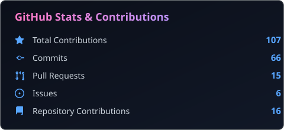
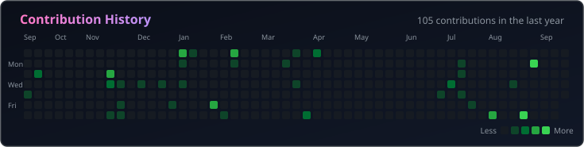

# Hi, I'm Bharath Kumar M S 👋

  
  
  

  
  
  

---

## 🧠 About Me

- 🎓 **Information Science & Engineering** student at RV College of Engineering, Bengaluru.
- 💡 Passionate about backend systems, scalable architecture, and developer tools.
- 📚 Currently deep-diving into **System Design, AI-powered applications, and Web3 development**.
- 💬 Ask me about **JavaScript, TypeScript, C++, Node.js, Go, Databases, and Docker**.
- ✉️ Reach me at [bharathkms8055@gmail.com](mailto:bharathkms8055@gmail.com).

---

## 💻 Tech Stack

### Languages

  
  
  
  
  

### Frontend

  
  
  
  

### Backend & Databases

  
  
  
  
  

### Tools & Infrastructure

  
  
  
  

---

## 🚀 Featured Projects

### 🔗 [@bharathsms18/otp-verify](https://github.com/18bharathkumar/bharath-otp-verify)
> Modular, security-focused Node.js OTP verification library. Supports automatic generation, hashing, rate limiting, and flexible email adapters (Gmail, custom SMTP). Designed for seamless integration in web and mobile apps.
> 
> 

>   
>   
>   
> 

---

## 📊 GitHub Statistics

<!-- GITHUB_STATS_START -->

  

  

<!-- GITHUB_STATS_END -->

---

## 🏆 LeetCode Statistics

<!-- LEETCODE_STATS_START -->
*LeetCode statistics will be added here once the username is configured.*
<!-- LEETCODE_STATS_END -->
